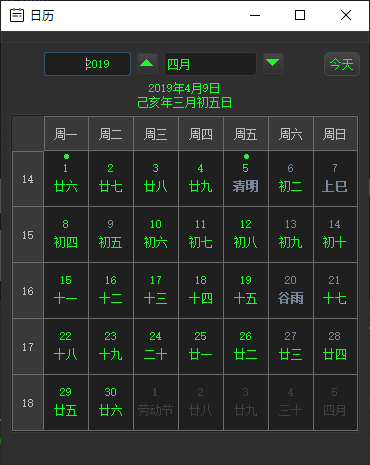

LunarCalendar
==============

Author: KangLin (kl222@126.com)

[Chinese](README_zh_CN.md)

- [](https://ci.appveyor.com/project/KangLin/lunarcalendar/branch/master)
- [](https://travis-ci.org/KangLin/LunarCalendar)

------------------------------------------------

### Table of Contents:
- [Features](#Features)
- [Donation](#Donation)
- [Screenshots](#Screenshots)
- [Compile](#Compile)
- [Other application use the libary](#Other-application-use-the-libary)
- [Contribution](#Contribution)
- [License Agreement](#License-Agreement)
    - [The third-party libraries](#The-third-party-libraries)

### Features

The lunar calendar written by Qt. It provides:

- A lunar calendar library of Qt GUI, support QSS.
   + Solar calendar
   + Lunar calendar
   + Solar and Lunar holiday
   + Solar and Lunar Day (eg birthday, wedding anniversary, etc.)
   + Month view
   + Week view
- A simple calendar app. Used to illustrate how to use this lunar calendar library.
- A complete application of this library [Tasks](https://github.com/KangLin/Tasks)
- Cross-platform, support multiple operating systems
   + [x] Windows
   + [x] Linux、Unix
   + [x] Android
   + [ ] Mac os
   + [ ] IOS

Mac os and IOS, I don't have the corresponding equipment,
please compile and test the students with the corresponding equipment.

### Donation
- Donation (greater than ¥20):  
")

- Donate ¥20  


------------------------------------------------

### Screenshots
- Windows




- Android


------------------------------------------------

### [Download setup package](https://github.com/KangLin/LunarCalendar/releases/latest)

- linux
    + [LunarCalendar_v0.1.0.tar.gz](https://github.com/KangLin/LunarCalendar/releases/download/v0.1.0/LunarCalendar_v0.1.0.tar.gz)
      The AppImage format executable can be run directly on the Linux system, see: https://appimage.org/  
      usage:

      1. Decompress. Copy LunarCalendar_v0.1.0.tar.gz to install dirctory, then decompress it:

                mkdir LunarCalendar
                cd LunarCalendar
                cp $DOWNLOAD/LunarCalendar_v0.1.0.tar.gz .
                tar xvfz LunarCalendar_v0.1.0.tar.gz

      2. install

                ./install.sh install

      3. If you want to uninstall

                ./install.sh remove

- ubuntu
    + [lunarcalendar_0.1.0_amd64.deb](https://github.com/KangLin/LunarCalendar/releases/download/v0.1.0/lunarcalendar_0.1.0_amd64.deb)
      Deb installation package for Ubuntu

- windows
    + [LunarCalendar-Setup-v0.1.0.exe](https://github.com/KangLin/LunarCalendar/releases/download/v0.1.0/LunarCalendar-Setup-v0.1.0.exe)
      Windows installation package, support for Windows xp and above


- android
    + [android-build-debug.apk](https://github.com/KangLin/LunarCalendar/releases/download/v0.1.0/android-build-debug.apk)
    Android installation package

------------------------------------------------

- Directory

```
  |-App                  application source code
  |-Src                  calendar library source code
     |- LunarCalendar.h  calendar interface header file
```

------------------------------------------------

### Compile

- Depend
  [RabbitCommon](https://github.com/KangLin/RabbitCommon)

  ```
  git clone https://github.com/KangLin/RabbitCommon.git
  ```

- Create and enter the build directory

        git clone --recursive https://github.com/KangLin/LunarCalendar.git
        cd LunarCalendar
        mkdir build

+ Use qmake

        cd build
        qmake ../LunarCalendar.pro RabbitCommon_DIR=
        make install

+ Use cmake

        cd build
        cmake .. -DQt5_DIR=${QT_ROOT}/lib/cmake/Qt5 -DRabbitCommon_DIR=
        cmake --build .

- Note
    + windows
       If you build app. Qt does not provide openssl dynamic library for copyright reasons, so you must copy the dynamic library of openssl to the installation directory.
        - If it is 32, you can find the dynamic library of openssl (libeay32.dll, ssleay32.dll) in the Qt installer Tools\QtCreator\bin directory.
        - If it is 64-bit, you will need to download the binary installation package for openssl yourself.

    + linux

     ```
     sudo apt-get install libssl1.1
     ```

------------------------------------------------
### Other application use the libary

- Direct use the libary source code.
    + cmake
        - Submodule
            + add submodule:

                  git submodule add https://github.com/KangLin/LunarCalendar.git 3th_lib/LunarCalendar
                  git submodule update --init --recursive


            + Add follow code in CMakeLists.txt

                  add_subdirectory(3th_lib/LunarCalendar/Src)

        - No submodule
            + Download LunarCalendar source code from https://github.com/KangLin/LunarCalendar

                  git clone --recursive https://github.com/KangLin/LunarCalendar.git


            + Add follow code in CMakeLists.txt

                  set(LunarCalendar_DIR $ENV{LunarCalendar_DIR} CACHE PATH "Set LunarCalendar source code root directory.")
                  if(EXISTS ${LunarCalendar_DIR}/Src)
                      add_subdirectory(${LunarCalendar_DIR}/Src ${CMAKE_BINARY_DIR}/LunarCalendar)
                  else()
                      message("1. Please download LunarCalendar source code from https://github.com/KangLin/LunarCalendar")
                      message("   ag:")
                      message("       git clone https://github.com/KangLin/LunarCalendar.git")
                      message("2. Then set cmake value or environment variable LunarCalendar_DIR to download root dirctory.")
                      message("   ag:")
                      message(FATAL_ERROR "       cmake -DLunarCalendar_DIR= ")
                  endif()

            + Add libraries and include in CMakeLists.txt

                  SET(APP_LIBS ${PROJECT_NAME} ${QT_LIBRARIES})
                  if(TARGET LunarCalendar)
                      target_compile_definitions(${PROJECT_NAME}
                          PRIVATE -DLunarCalendar)
                      target_include_directories(${PROJECT_NAME}
                          PRIVATE "${LunarCalendar_DIR}/Src"
                          "${LunarCalendar_DIR}/Src/export")
                      set(APP_LIBS ${APP_LIBS} LunarCalendar)
                  endif()
                  target_link_libraries(${PROJECT_NAME} ${APP_LIBS})

- Use in library mode
    + Qt project file
        + Environment variable（LunarCalendar_DIR）or QMAKE parameters LunarCalendar_DIR Specify the location of the LunarCalendar install root directory, then add the following to the main project file (.pro):

                isEmpty(LunarCalendar_DIR): LunarCalendar_DIR=$$(LunarCalendar_DIR)
                !isEmpty(LunarCalendar_DIR): exists("$${LunarCalendar_DIR}/include/LunarCalendar.h"){
                     DEFINES += LunarCalendar
                     INCLUDEPATH *= $${LunarCalendar_DIR}/include $${LunarCalendar_DIR}/include/export
                     LIBS *= -L$${LunarCalendar_DIR}/lib -lLunarCalendar
                 } else{
                     message("1. Please download LunarCalendar source code from https://github.com/KangLin/LunarCalendar ag:")
                     message("   git clone https://github.com/KangLin/LunarCalendar.git")
                     message("2. Build and make install the project")
                     error("3. Then set value LunarCalendar_DIR to install dirctory")
                 }

    + cmake
        - Cmake parameter LunarCalendar_DIR specifies the installation root directory

                find_package(LunarCalendar)

        - Add libraries and include in CMakeLists.txt

                SET(APP_LIBS ${PROJECT_NAME} ${QT_LIBRARIES})
                if(LunarCalendar_FOUND)
                    target_compile_definitions(${PROJECT_NAME}
                                PRIVATE -DLunarCalendar)
                    target_include_directories(${PROJECT_NAME}
                                PRIVATE "${LunarCalendar_INCLUDE_DIRS}/Src"
                                        "${LunarCalendar_INCLUDE_DIRS}/Src/export")
                    set(APP_LIBS ${APP_LIBS} ${LunarCalendar_LIBRARIES})
                endif()
                target_link_libraries(${PROJECT_NAME} ${APP_LIBS})

- Load translator
    + Use libary function

            CLunarCalendar::InitResource();

    + Customize

            QString szPre;
            #if defined(Q_OS_ANDROID) || _DEBUG
                szPre = ":/Translations";
            #else
                szPre = qApp->applicationDirPath() + QDir::separator() + ".." + QDir::separator() + "translations";
            #endif
            m_Translator.load(szPre + "/LunarCalendar_" + QLocale::system().name() + ".qm");
            qApp->installTranslator(&m_Translator);

------------------------------------------------

### Contribution

- Question: https://github.com/KangLin/LunarCalendar/issues
- Project location: https://github.com/KangLin/LunarCalendar

------------------------------------------------

### [License Agreement](License.md "License.md")

Please follow the license agreement for the third-party libraries below and the license and thank the authors of the third-party libraries.

#### The third-party libraries

- [sxtwl_cpp](https://github.com/yuangu/sxtwl_cpp)
