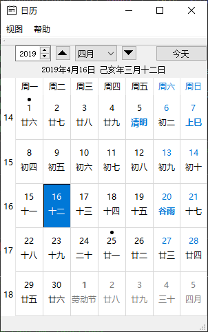
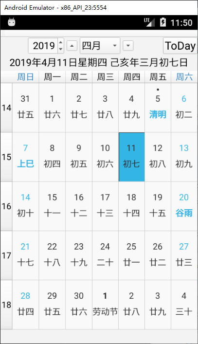

## LunarCalendar

=========================================================

Author: KangLin (kl222@126.com)

[Chinese](README_zh_CN.md)
------------------------------------------------

### Features

The lunar calendar written by Qt. It provides:

- A lunar calendar library of Qt GUI, support QSS.
- A simple calendar app.
- A complete application of this library [Tasks](https://github.com/KangLin/Tasks)

------------------------------------------------
### Support system

- [x] Windows
- [x] Linux、Unix
- [x] Android
- [ ] Mac os
- [ ] IOS

------------------------------------------------

- 
- 

------------------------------------------------

### Screenshots

------------------------------------------------

### Compile
- Create and enter the build directory

        git clone --recursive https://github.com/KangLin/LunarCalendar.git
        cd LunarCalendar
        mkdir build

+ Use qmake 

      cd build
      qmake ../LunarCalendar.pro
      make install
  
+ Use cmake

      cd build
      cmake ..
      cmake --build .

------------------------------------------------
### Use
- Direct source code.
    + Qt project
      - Submodule:
        + add submodule：
        
                git submodule add https://github.com/KangLin/LunarCalendar.git 3th_libs/LunarCalendar

        + include LunarCalendar.pri in qt project file
        
                include(3th_libs/LunarCalendar/LunarCalendar.pri)

      - No submodule:
        + Download LunarCalendar source code from https://github.com/KangLin/LunarCalendar

            git clone https://github.com/KangLin/LunarCalendar.git

        + Add follow code in qt project file
        
            isEmpty(LunarCalendarRoot): LunarCalendarRoot=$$(LunarCalendarRoot)
            !isEmpty(LunarCalendarRoot): exists("$${LunarCalendarRoot}/Src/LunarCalendar.pri"){
                DEFINES += LunarCalendar
                include($${LunarCalendarRoot}/Src/LunarCalendar.pri)
            } else{
                message("1. Please download LunarCalendar source code from https://github.com/KangLin/LunarCalendar ag:")
                message("   git clone https://github.com/KangLin/LunarCalendar.git")
                message("2. Then set value LunarCalendarRoot to download root dirctory")
            }

  + Is a QT project, directly introduces LunarCalendar.pri

        include(LunarCalendar.pri)

  + cmake project

        add_subdirectory(3th_libs/LunarCalendar/Src)
        
- Load translator
  + Use libary function

        CLunarCalendar::InitTranslator();

  + Customize
  
        QString szPre;    
        #if defined(Q_OS_ANDROID) || _DEBUG
            szPre = ":/Translations";
        #else
            szPre = qApp->applicationDirPath() + QDir::separator() + ".." + QDir::separator() + "translations";
        #endif
        m_Translator.load(szPre + "/LunarCalendar_" + QLocale::system().name() + ".qm");
        qApp->installTranslator(&m_Translator);

------------------------------------------------

### Download
https://github.com/KangLin/LunarCalendar/releases/latest

------------------------------------------------

## Donation
- Donation (greater than ¥20):  
")

- Donate ¥20  

------------------------------------------------

### [License Agreement](License.md "License.md")

Please follow the license agreement for the third-party libraries below and the license and thank the authors of the third-party libraries.

#### The third-party libraries

- [sxtwl_cpp](https://github.com/yuangu/sxtwl_cpp)
