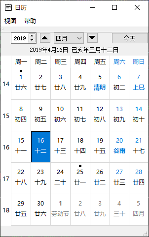
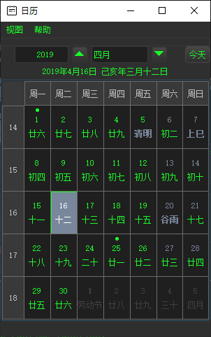
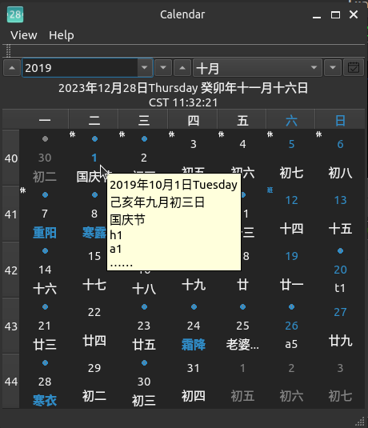
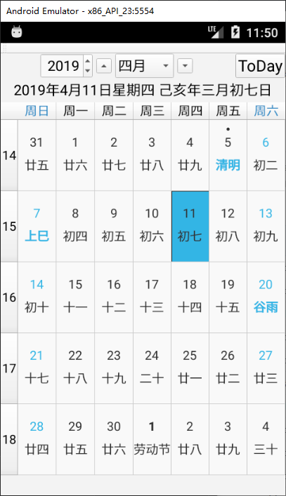
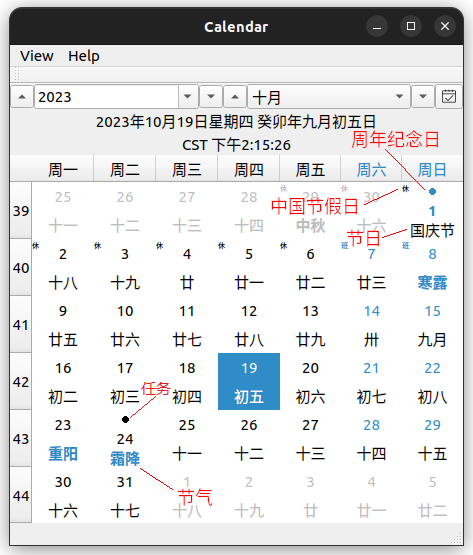

## 农历日历

作者：康 林 <kl222@126.com>

------------------------------------------------

[:us: English](README.md)

- 项目位置: 
  - 主库: https://github.com/KangLin/LunarCalendar
  - 镜像库：
    - https://gitee.com/kl222/LunarCalendar
    - https://gitlab.com/kl222/LunarCalendar
    - https://sourceforge.net/projects/lunarcalendar/
    - https://invent.kde.org/kanglin/LunarCalendar
    - https://launchpad.net/lunarcalendar
    - https://bitbucket.org/kl222/lunarcalendar
- [项目主页](https://kanglin.github.io/LunarCalendar/html/index.html)

------------------------------------------------

- 

- 主分支

- 开发分支

------------------------------------------------

### 目录：

- [功能](#功能)
- [下载安装包](#下载安装包)
- [捐赠](#捐赠)
- [屏幕截图](#屏幕截图)
- [编译](#编译)
- [其它应用使用本项目](#其它应用使用本项目)
- [贡献](#贡献)
- [许可协议](#许可协议)
    + [第三方库](#第三方库)

------------------------------------------------

### 功能

Qt 写的农历。它提供：

- 一个Qt界面的农历日历库，支持 QSS (换肤功能）。
  + 阳历
  + 农历
  + 阳历和农历节日（例如：中国节假日(一群闲得蛋疼的人搞出来的玩意)，节气）
  + 阳历和农历周年纪念日（例如：生日，结婚纪念日等）
  + 在日历上显示用户自定义任务提示（用高亮圆点显示）
  + 工具提示(ToolTip)显示详细的提示内容
  + 月视图
  + 周视图
- 示例
  + 一个简单的日历应用程序。用于示例如何使用此农历日历库。
  + 此库的一个完整应用 [日历](https://github.com/KangLin/Calendar)
- 跨平台，支持多操作系统。
  详见：[Qt5 支持平台](https://doc.qt.io/qt-5/supported-platforms.html)、[Qt6 支持平台](https://doc.qt.io/qt-6/supported-platforms.html)。
  + [x] Windows
  + [x] Linux、Unix
  + [x] Android
  + [x] Mac os
  + [ ] IOS

Mac os 和 IOS ，本人没有相应设备，请有相应设备的同学自己编译，测试。

### 捐赠

### 屏幕截图
- Windows

- Ubuntu

- Android

- 任务

### 下载安装包

[下载安装包](https://github.com/KangLin/LunarCalendar/releases/latest)

- 开发包： *.zip
- 示例程序安装包：
  - Ubuntu: *.deb
  - Windows: *.exe
  - Android: *.apk
- 文档：[LunarCalendar_v1.0.3_document.zip](https://github.com/KangLin/LunarCalendar/releases/download/v1.0.3/LunarCalendar_v1.0.3_document.zip)

### 文档

- [在线文档](https://kanglin.github.io/LunarCalendar/html/index.html)

- [使用文档](Docs/User.md)
- [开发文档](Docs/Developer.md)

### 贡献

- [问题](https://github.com/KangLin/LunarCalendar/issues)
- [项目位置](https://github.com/KangLin/LunarCalendar)
- [贡献者](https://github.com/KangLin/LunarCalendar/graphs/contributors)

### 许可协议

[许可协议](License.md "License.md")

请遵守本协议和下列第三方库的许可协议，并感谢第三方库的作者。

#### 第三方库

- [寿星天文历](https://github.com/yuangu/sxtwl_cpp) 

#### 使用本项目的项目

- [日历](https://github.com/KangLin/Calendar)
